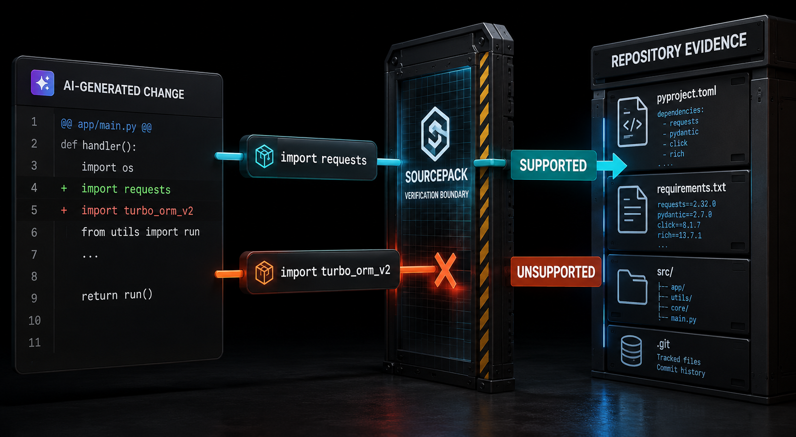

# SourcePack

<p align="center">
  
</p>


**SourcePack blocks AI-generated code changes that rely on repository facts the local codebase does not support.**

It checks proposed diffs against locally verifiable evidence such as tracked files, dependency manifests, scripts, commands, protected paths, trusted baseline artifacts, policy, and recorded execution evidence.

A simple example: an AI assistant adds FastAPI code to a repository that does not declare FastAPI. SourcePack detects the unsupported dependency and blocks the change before it becomes a review problem.

SourcePack is a local-first public-alpha guardrail. It does not prove code correctness, security, runtime success, semantic validity, dependency safety, external API truth, or user intent.

## Try the demo

```bash
python -m pip install sourcepack
sourcepack demo
```

The demo creates a small local repository, applies an unsupported FastAPI change, and runs SourcePack against it.

Expected decisive output:

```text
RED LIGHT: commit blocked
unsupported_dependency: sourcepack/server.py imports fastapi, but fastapi is not declared.

Verdict: FAIL
```

- `RED LIGHT` is the human stop signal.
- `Verdict: FAIL` is the formal judgment.
- `unsupported_dependency` is the machine-readable reason code.

## What SourcePack checks

SourcePack focuses on repository assumptions that can be tested locally:

- edits to files that do not exist
- undeclared imports or dependencies
- missing scripts and unsupported commands
- unsupported project ecosystems
- unsafe or protected paths
- malformed or binary diffs
- stale, missing, or corrupt trusted baselines
- policy violations in the proposed change
- bounded local execution evidence

Its judgment is deliberately narrow:

> This proposed change relies on a repository fact that the local evidence does not support.

SourcePack does not reject code merely because AI produced it.

## First five minutes

```bash
python -m pip install sourcepack
sourcepack demo
sourcepack init . --auto
sourcepack diff .
sourcepack report open
```

`sourcepack init . --auto` creates or refreshes local SourcePack state only after you decide the current repository state should be trusted. Do not use initialization to bless a failed AI patch.

## What SourcePack catches

| Case | Formal result | Reason code |
| --- | --- | --- |
| Missing or fake file edits | FAIL | `missing_file` |
| New or deleted file review | WARN | `new_file`, `deleted_file` |
| Undeclared imports or dependencies | FAIL | `unsupported_dependency` |
| Same-patch dependency additions | WARN | `declared_dependency` |
| Unsupported commands | FAIL | `unsupported_command` |
| Unsupported ecosystems | WARN | `unsupported_ecosystem` |
| Protected `.sourcepack/` edits | FAIL | `protected_artifact` |
| `.git/` path edits | FAIL | `git_path_modification` |
| Unsafe paths | FAIL | `unsafe_path`, `path_escape` |
| Binary or malformed diffs | WARN or FAIL by path and condition | `binary_diff`, `malformed_diff` |
| Missing, stale, or corrupt baseline | FAIL or WARN by state and mode | `baseline_missing`, `baseline_stale`, `baseline_corrupt` |
| Workflow automation changes | WARN or FAIL by mode and policy | `workflow_change` |

See [`docs/reason-codes.md`](docs/reason-codes.md) for exact behavior and remediation guidance.

## How the trust model works

SourcePack keeps reviewed repository evidence separate from AI guidance.

- **Baseline:** reviewed local enforcement state
- **Prompt context:** advisory material for an AI assistant
- **Diff:** the actual proposed repository change
- **Judgment:** the result of checking that change against trusted evidence and policy

Prompt context never becomes trust.

SourcePack refuses to create a trusted baseline from a dirty Git working tree unless `--force` is explicitly supplied. In CI, committed `.sourcepack/baseline/` state must be consumed as-is. CI must never create, refresh, repair, or silently bless trusted baseline state.

See [`docs/baseline-lifecycle.md`](docs/baseline-lifecycle.md).

## Reports, Workbench, CI, and evidence

A normal local run writes HTML, JSON, and Markdown reports under `.sourcepack/reports/`.

```bash
sourcepack diff .
sourcepack report open
sourcepack ui .
```

The read-only Workbench binds only to loopback and reads canonical SourcePack artifacts without modifying Git state, policy, baselines, reports, overrides, or decision ledgers.

Minimal CI usage:

```yaml
- uses: actions/checkout@v4
- run: python -m pip install sourcepack
- run: sourcepack diff . --ci
```

SourcePack also supports replay, evidence bundles, local execution evidence, repository policy, finding identities, overrides, decision ledgers, fleet summaries, and committed-range inspection.

See the [documentation index](docs/README.md) for exact commands and deeper workflows.

## Built with GPT-5.6 and Codex

SourcePack was developed through an inspectable AI-directed workflow:

1. product behavior and constraints were defined through GPT-5.6
2. GPT-5.6 converted those decisions into bounded implementation prompts, reviews, and correction prompts
3. Codex implemented repository changes and tests
4. the resulting pull requests were reviewed and merged through GitHub

The public repository history preserves both sides of that workflow, including a GPT-5.6-directed README change, Codex implementation PRs, and the trust-boundary failure that helped shape the current dirty-baseline guard.

See [`BUILD_WEEK.md`](BUILD_WEEK.md) for the dated evidence trail and judge path.

## What SourcePack is not

SourcePack is not a general AI code reviewer. It does not decide whether code is elegant, scalable, secure, production-ready, architecturally sound, or aligned with business intent.

It does not replace tests, type checkers, linters, security scanners, dependency review, runtime validation, or human review.

Use SourcePack when the disputed claim can be checked against local repository evidence.

## Status

SourcePack is in the v1.10 public-alpha series.

Core judgment behavior, packaging, reports, demos, policy resolution, replay, local execution evidence, CI behavior, evidence bundles, and the local Workbench are implemented. Public-alpha work continues around compatibility, packaging, integration coverage, and UX polish.

`sourcepack doctor --strict` checks local production-readiness prerequisites and packaged assets. Hosted GitHub Actions remain the source of truth for hosted checks.

## Public proof links

- [Build Week evidence](BUILD_WEEK.md)
- [Documentation](docs/README.md)
- [Changelog](CHANGELOG.md)
- [Reason codes](docs/reason-codes.md)
- [CI usage](docs/ci.md)
- [Problem fit](docs/problem-fit.md)
- [AI-agent workflow](docs/ai-agent-workflow.md)
- [Public-alpha readiness](docs/public-alpha-readiness.md)
- [License](LICENSE)
