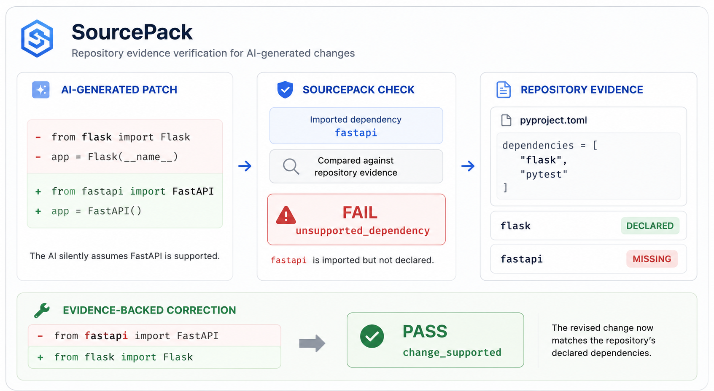

<p align="center">
  
</p>


# SourcePack

**SourcePack blocks AI-generated code changes that rely on fake repo facts.**

SourcePack is a Python 3.11+ command-line tool, local Workbench, and GitHub Action for checking a proposed change against evidence that a maintainer has accepted from the repository. It finds locally testable mismatches—such as edits to nonexistent files, undeclared imports, unsupported commands, protected trust-state changes, and unsafe paths—before commit or in pull-request CI.

SourcePack is local-first and deterministic. It evaluates the change, policy, repository evidence, and bounded execution records without sending the repository to an AI service. It does not reject a change merely because AI produced it.

> SourcePack answers a narrow question: does this change rely on a repository fact that the accepted local evidence does not support?

It does **not** establish that code is correct, secure, useful, or ready to ship. Keep tests, type checking, linting, security scanning, dependency review, and human review in the development loop.

## See it catch an unsupported assumption

[Open the static interactive showcase](https://joshuavetos.github.io/sourcepack/) to follow an unsupported FastAPI change from finding to correction. The showcase uses SourcePack-generated fixture data; it does not execute SourcePack in the browser.

## Try the demo

```bash
python -m pip install sourcepack
sourcepack demo
```

The packaged demo creates a small temporary repository, applies an unsupported FastAPI change, runs SourcePack against it, and prints the generated packet and judgment paths.

Expected decisive output:

```text
RED LIGHT: commit blocked
unsupported_dependency: sourcepack/server.py imports fastapi, but fastapi is not declared.

Verdict: FAIL
```

A separate Workbench walkthrough demonstrates the full correction loop: unsupported FastAPI produces `FAIL` / `unsupported_dependency`, and a manually prepared revision using repository-supported Flask produces `PASS` with the presentation label `change_supported`. This scenario is documented in [`docs/workbench-review-flow.md`](docs/workbench-review-flow.md); `sourcepack demo` does not launch or prepare Workbench.

- `RED LIGHT` is the human stop signal.
- `Verdict: FAIL` is the canonical judgment.
- `unsupported_dependency` is the machine-readable reason code.

## Install and use

SourcePack requires Python 3.11 or newer.

```bash
python -m pip install sourcepack
sourcepack --version
sourcepack doctor --strict
```

Initialize a repository only after reviewing its current state and deciding that it is an acceptable basis for future comparisons:

```bash
cd your-repository
sourcepack init . --auto
git add .sourcepack/baseline
git commit -m "Add accepted SourcePack baseline"
```

`sourcepack init . --auto` refuses to create trusted baseline state from a dirty Git working tree unless `--force` is deliberately supplied. Initialization is a maintainer trust decision, not a way to make an existing finding disappear. Review the generated `.sourcepack/baseline/` state before committing it.

Then inspect local changes from the terminal or Workbench:

```bash
sourcepack diff .
sourcepack diff . --staged
sourcepack ui .
sourcepack report path
sourcepack report open
```

Local mode exits nonzero for `FAIL`; `WARN` is non-blocking. Use `--strict` or `--ci` when warnings must also block. `--ci` emits machine-readable JSON.

## First five minutes

```bash
python -m pip install sourcepack
sourcepack demo
sourcepack init . --auto
sourcepack ui .
```

After initialization, make a change and click **Run Review** in Workbench. Inspect the findings and their evidence, copy the deterministic remediation prompt if useful, let your coding tool revise the repository, and click **Run Review Again**. Workbench uses the same authority-bearing judgment entry point as `sourcepack diff .`; it cannot edit code, invoke an AI coding agent, run arbitrary commands, or silently trust a baseline.

## What SourcePack checks

SourcePack focuses on repository assumptions that can be tested locally:

- AI coding agents can edit files that do not exist.
- They can import undeclared dependencies.
- They can reference missing scripts or unsupported commands.
- They can reshape project structure based on prompt assumptions.
- SourcePack catches those locally verifiable failures before commit or in CI.

| Change or state | Typical result | Reason code |
| --- | --- | --- |
| Edit to a missing or invented file | FAIL | `missing_file` |
| New or deleted file | WARN | `new_file`, `deleted_file` |
| Undeclared import or dependency | FAIL | `unsupported_dependency` |
| Dependency declared in the same change | WARN | `declared_dependency` |
| Missing repository command | FAIL | `unsupported_command` |
| Unsupported ecosystem marker | WARN | `unsupported_ecosystem` |
| Protected `.sourcepack/` edit | FAIL | `protected_artifact` |
| `.git/` path edit | FAIL | `git_path_modification` |
| Unsafe or escaping path | FAIL | `unsafe_path`, `path_escape` |
| Binary or malformed diff | WARN or FAIL, depending on condition | `binary_diff`, `malformed_diff` |
| Missing, stale, or corrupt baseline | FAIL or WARN, depending on state and mode | `baseline_missing`, `baseline_stale`, `baseline_corrupt` |
| Workflow automation change | WARN or policy-dependent FAIL | `workflow_change` |
| Symlink replacing a proven nonempty directory | FAIL | `symlink_replaces_nonempty_directory` |

Python and Node.js have dedicated dependency evidence adapters. Recognized but not fully modeled ecosystems—including Cargo, Go modules, Maven, Gradle, Bundler, Composer, .NET projects, Terraform, and Nix flakes—produce explicit uncertainty rather than being silently treated as understood. See the complete, canonical behavior table in [`docs/reason-codes.md`](docs/reason-codes.md) and the current constraints in [`docs/limitations.md`](docs/limitations.md).

## Trust model

SourcePack keeps authority separate from advice:

1. **Accepted baseline:** repository evidence accepted through a maintainer-controlled workflow.
2. **Integrity check:** SHA-256 receipt hashes detect later changes to stored baseline artifacts.
3. **Prompt context:** optional, non-authoritative guidance for an AI assistant.
4. **Proposed diff:** working-tree, staged, supplied-patch, or committed-range changes to inspect.
5. **Policy and execution evidence:** bounded local inputs that can affect or explain judgment.
6. **Judgment:** canonical `PASS`, `WARN`, or `FAIL` plus findings and reason codes.

Hash agreement does not authenticate the baseline's creator or prove that its contents were reviewed. Prompt context never becomes enforcement authority. In pull-request CI, SourcePack consumes the reviewed baseline committed to the repository; CI must never create, refresh, repair, or silently bless baseline state. See [`docs/baseline-lifecycle.md`](docs/baseline-lifecycle.md) for the full lifecycle.

## Reports and evidence

A local review writes canonical report artifacts under `.sourcepack/reports/`:

| Surface | Purpose |
| --- | --- |
| `latest.json` | machine-readable judgment, findings, provenance, and replay data |
| `latest.md` | human-readable text report |
| `latest.html` | local rendered review report |
| Workbench | authenticated local UI and bounded Command Center snapshot |
| SARIF | optional CI/code-scanning interchange |
| Evidence bundle | portable, verifiable local review evidence |

Additional commands support non-authoritative prompt context, bounded command execution evidence, report replay, finding explanations and decisions, policy validation, schema validation, and fleet summaries. Use `sourcepack --help` and each subcommand's `--help` for the installed version; use the [documentation index](docs/README.md) for workflows and trust-boundary details.

## Pull-request CI

CI must start with reviewed, committed `.sourcepack/baseline/` state and must expose the pull-request delta to the working tree. A clean checkout of the PR head contains no local diff for `sourcepack diff .` to inspect.

```yaml
- uses: actions/checkout@v4
  with:
    ref: ${{ github.event.pull_request.head.sha }}
    fetch-depth: 0
- run: git fetch --no-tags origin ${{ github.event.pull_request.base.ref }}
- run: git reset --mixed ${{ github.event.pull_request.base.sha }}
- uses: actions/setup-python@v5
  with:
    python-version: "3.11"
- run: python -m pip install sourcepack
- run: sourcepack diff . --ci --json
```

The bundled composite action can also emit JSON, Markdown, command records, SARIF, uploaded artifacts, step summaries, and an optional update-in-place pull-request comment. PR commenting is presentation-only: an unavailable token or comment failure does not replace the SourcePack verdict. Copy the complete workflow, permission requirements, and fork caveats from [`docs/github-action-quickstart.md`](docs/github-action-quickstart.md) rather than relying on this abbreviated example.

## Current scope and status

The package metadata identifies the repository as the `1.10.0a3` public-alpha release. The implemented surfaces include:

- working-tree, staged, supplied-patch, and committed-range review;
- integrity-checked accepted baselines and local/organization policy resolution;
- canonical JSON, Markdown, HTML, and SARIF reporting;
- evidence graphs, replay data, evidence bundles, overrides, and decision ledgers;
- bounded local execution evidence and deterministic remediation prompts;
- an authenticated local Workbench and versioned internal Command Center snapshot;
- Git hooks, pull-request CI, a composite GitHub Action, and fleet summaries;
- public JSON Schema validation and an optional hosted-control-plane surface;
- a baseline-owned Architecture Contract Layer for declared Python forbidden direct imports, with rule-scoped drift and last-known-valid evidence.

Operational inputs are deliberately bounded. When evidence acquisition is incomplete, SourcePack preserves that uncertainty rather than turning the retained prefix into authoritative `PASS`. The detailed repository-grounded implementation inventory is in [`docs/current-behavior-audit.md`](docs/current-behavior-audit.md), and release changes are in [`CHANGELOG.md`](CHANGELOG.md).

## High-value next improvements

These are opportunities, **not implemented behavior**. They are ordered roughly by how much they could broaden day-to-day usefulness.

### Coverage and accuracy

- Add first-class dependency and command adapters for Rust, Go, Java/Kotlin, Ruby, PHP, .NET, Terraform, and Nix.
- Model monorepo workspaces and dependency scope explicitly, including package ownership, nested manifests, and cross-package changes.
- Expand Python and Node.js alias, extras, workspace, lockfile, generated-code, and dynamic-import handling while retaining visible uncertainty.
- Expand architecture evidence beyond the current bounded forbidden-direct-import contract into local symbols, configuration keys, routes, and schema fields.
- Add migration- and schema-aware checks for databases, API specifications, infrastructure plans, and generated clients.

### Workflow integrations

- Provide documented pre-commit/pre-push integrations, reusable workflows for other CI providers, and a stable check-run annotation experience.
- Build IDE integrations that show findings and evidence at the edited line; the existing VS Code work is currently a plan, not a shipped extension.
- Offer a supported machine API or SDK around the public judgment facade, with compatibility policy and examples for coding-agent integrations.
- Add policy packs and organization presets that can be reviewed, pinned, composed, and explained without weakening local authority.

### Trust and collaboration

- Add signed baseline/receipt provenance and optional maintainer approval metadata while preserving the distinction between integrity and identity.
- Improve safe baseline-update workflows with reviewable deltas, expiry/refresh guidance, ownership rules, and branch-protection examples.
- Add richer, auditable suppression lifecycles: owners, justification templates, expiration, review status, and policy-controlled approval.
- Make evidence bundles easier to compare across revisions and easier to attach to code review without exposing sensitive repository content.

### Usability and operations

- Add a guided setup wizard that explains trust decisions, detects repository layout, previews generated state, and validates CI configuration.
- Improve finding prioritization, side-by-side correction comparisons, historical trends, and team-oriented review queues in Workbench.
- Add incremental scanning and caching with explicit invalidation so large repositories are faster without reusing stale authority.
- Expand fleet reporting with ownership, policy drift, baseline age, recurring reason codes, and export formats while keeping summaries non-authoritative.
- Publish platform-specific installation and troubleshooting guidance, broaden native Windows/macOS/Linux verification, and test more Git/filesystem edge cases.

### Quality and project health

- Grow the checked-in external-repository corpus and publish repeatable false-positive/false-negative measurements by ecosystem.
- Add property-based and coverage-guided fuzzing for diff parsing, path handling, manifests, policies, reports, and evidence bundles.
- Define performance budgets and benchmarks for large diffs, large monorepos, Workbench payloads, and fleet discovery.
- Publish a contributor guide, development setup, support policy, compatibility/deprecation policy, architecture decision records, and a versioned roadmap.
- Automate documentation/CLI/schema drift checks and publish a capability matrix that separates supported, partial, and unsupported behavior.

Contributions should preserve SourcePack's central invariant: missing or incomplete evidence must remain visible and must never be silently upgraded into trust.

## What SourcePack is not

SourcePack is not a general AI code reviewer. It does not decide whether code is elegant, scalable, secure, production-ready, architecturally sound, or aligned with business intent. It does not replace tests, type checkers, linters, security scanners, dependency review, runtime validation, or human review.

Use SourcePack when the disputed claim can be checked against local repository evidence.

## What SourcePack does not claim

- does not prove code correctness
- does not prove security
- does not prove runtime success
- does not prove semantic validity
- does not prove external API truth
- does not prove dependency safety
- does not prove user intent

## Project links

- [Documentation](docs/README.md)
- [Architecture](docs/architecture.md)
- [Current behavior audit](docs/current-behavior-audit.md)
- [Reason codes](docs/reason-codes.md)
- [CI usage](docs/ci.md)
- [Problem fit](docs/problem-fit.md)
- [Limitations](docs/limitations.md)
- [Security policy](SECURITY.md)
- [Changelog](CHANGELOG.md)
- [License](LICENSE)
